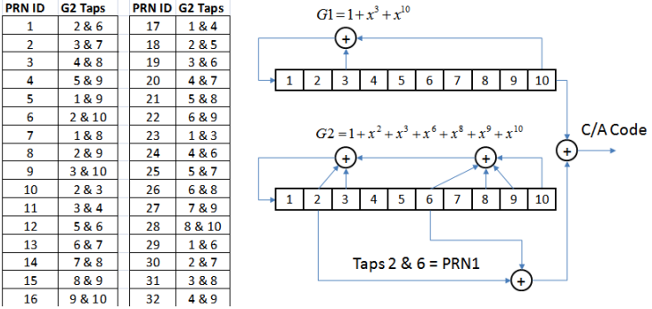
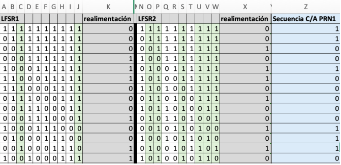

# SSI-P04
## Cómo compilar y ejecutar el programa
> [!WARNING]
> Es necesario tener instalado **'make'** y **'cmake'**. Además de **'g++'** y **'gcc'**.
```bash
$ make clean
$ make build
$ ./build/bin/CA_Generator
```
ó
```bash
$ make reload
$ ./build/bin/CA_Generator
```
## Objetivo
Implementar el generador de secuencias **Coarse/Acquisition (C/A)** de GPS según la descripción de la asignatura.

## Ejemplo
### 📥 Entrada
- **ID del satélite** (Número entero, por ejemplo: `1`).
- **Longitud de la secuencia de salida** (Número entero, por ejemplo: `14`).
### 📤 Salida
Una secuencia C/A generada de acuerdo con el ID del satélite.
